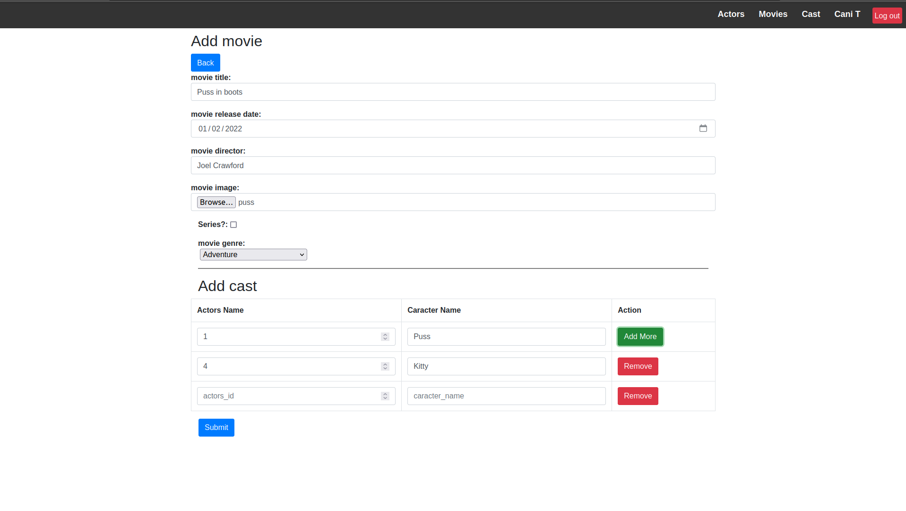

<h1 align="center" id="title">Movie App</h1>

<p id="description">This web application is made as a university project it is build with Laravel.</p>

<h2>Project Screenshots:</h2>




  
  
<h2>🧐 Features</h2>

Here're some of the project's best features:

*   Ability to add edit delete movies actors cast
*   Ability to login with build in authentication system
*   Login in with google
*   Seach movies actors cast
*   LiveSeach

<h2>🛠️ Installation Steps:</h2>

<p>1. clone the repo</p>

```
git clone git@github.com:CaniTanushaj/RNWA.git
```

<p>2. go into 4.x directory</p>

```
cd 4.x
```

<p>3. Install composer</p>

```
composer install
```

<p>4. Generate project key</p>

```
php artisan key:generate
```

<p>5. Create storange link</p>

```
php artisan storage:link
```

<p>6. Configure the database on .env file</p>

<p>7. Generate migrations</p>

```
php artisan migrate
```

<p>8. Seed the database</p>

```
php artisan db:seed
```

<p>9. Install Node package manager</p>

```
npm install
```

<p>10. Build the npm</p>

```
npm run build
```

<p>11. Run the application with</p>

```
php artisan serve
```

  
  
<h2>💻 Built with</h2>

Technologies used in the project:

*   Laravel
*   Blade Templates
*   OAuth
*   Bootstrap
*   Eloquent
*   LiveWire
*   TypeAhead